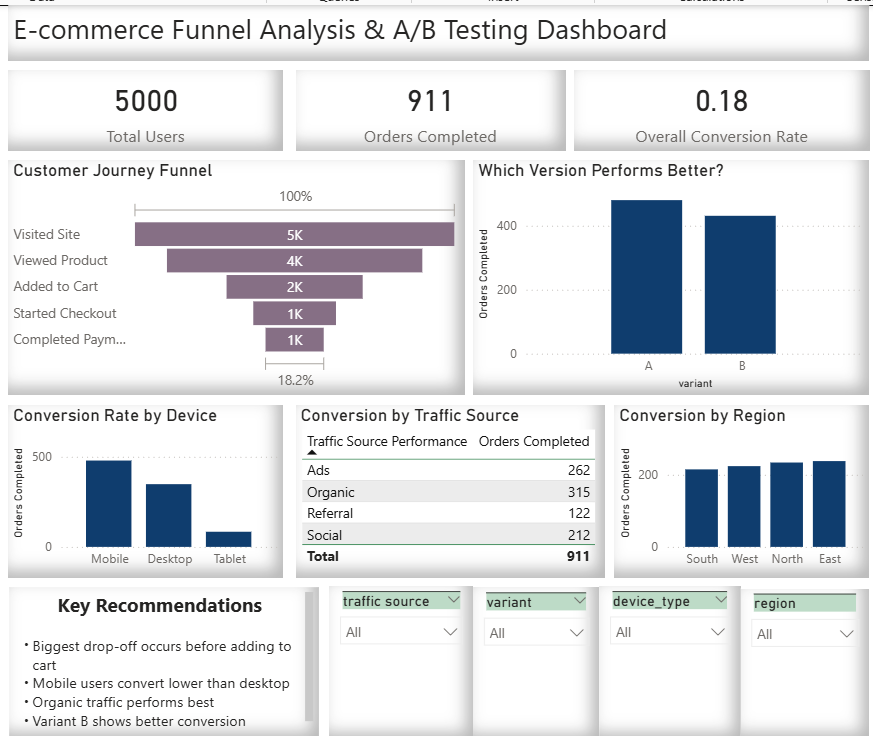
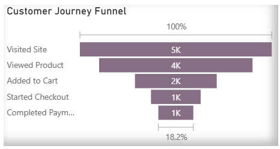
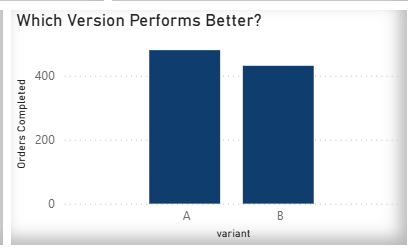
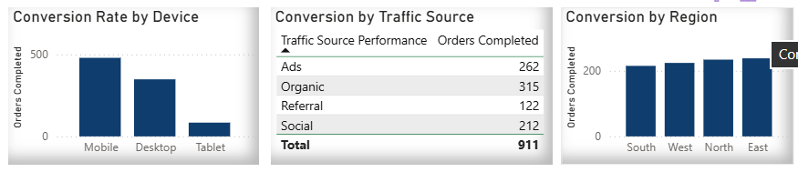
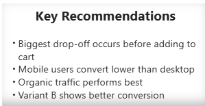

# 🚀 AI-Powered Funnel Analysis & A/B Testing System for E-commerce Optimization

---

## 📌 1. Project Overview

This project analyzes user behavior across an e-commerce funnel to identify drop-off points, evaluate A/B test performance, and generate data-driven recommendations to improve conversion rates.

It simulates real-world user interaction data and builds a complete analytics workflow including:
- Data generation
- Data validation
- Funnel analysis (upcoming)
- A/B testing (upcoming)
- AI-based recommendations (upcoming)
- Dashboard visualization (upcoming)

---

## 🎯 2. Business Objective

The main objective of this project is to:

- Analyze how users move through an e-commerce funnel
- Identify stages where users drop off
- Compare performance between A/B test variants
- Generate actionable recommendations to improve conversions
- Build a system that supports data-driven decision making

---

## ❓ 3. Key Business Questions

This project aims to answer the following:

1. What is the conversion rate at each stage of the funnel?
2. At which stage do users drop off the most?
3. Which user segments (device, traffic source, region) perform poorly?
4. Does Variant B perform better than Variant A?
5. What improvements can increase overall conversion rate?

---

## 🔁 4. Funnel Definition

The user journey (funnel) is defined as:

Visit Site → View Product → Add to Cart → Start Checkout → Complete Payment

Each step represents a stage in the conversion process.

---

## 📊 5. Success Metric

**Primary Metric:**
- Overall Conversion Rate = Completed Payments / Total Users

**Secondary Metrics:**
- Stage-wise conversion rates
- Drop-off rates at each stage
- Segment-wise performance

---

## 🛠️ 6. Tech Stack

### 🔹 Programming & Analysis
- Python

### 🔹 Python Libraries
- pandas → data manipulation and analysis
- numpy → numerical operations and data simulation
- matplotlib → basic data visualization
- seaborn → advanced visualization
- scipy → statistical testing (A/B testing)
- scikit-learn → machine learning (AI layer)

### 🔹 Development Environment
- Jupyter Notebook

### 🔹 Database & Querying (Upcoming)
- SQL (SQLite / MySQL)

### 🔹 Visualization (Upcoming)
- Power BI / Tableau

### 🔹 Version Control
- GitHub

---

## 📁 7. Project Structure
ai-funnel-analysis-ab-testing/
│
├── data/ # Raw and cleaned datasets
├── notebooks/ # Jupyter notebooks for analysis
├── sql/ # SQL queries
├── dashboard/ # Power BI/Tableau dashboards
├── images/ # Charts and screenshots
├── reports/ # Final reports and summaries
└── README.md # Project documentation

## 📦 8. Dataset Creation

A synthetic dataset was created to simulate real-world user behavior on an e-commerce platform.

### 📌 Dataset Details
- Total users: 5000
- Total columns: 13

---

## 📋 9. Dataset Features

| Column | Description |
|--------|------------|
| user_id | Unique identifier for each user |
| date | Timestamp of user session |
| traffic_source | Source of user traffic (Organic, Ads, Social, Referral) |
| device_type | Device used (Mobile, Desktop, Tablet) |
| region | Geographic region |
| variant | A/B test group (A or B) |
| visited_site | User visited website (1/0) |
| viewed_product | User viewed product (1/0) |
| added_to_cart | User added product to cart (1/0) |
| started_checkout | User started checkout (1/0) |
| completed_payment | User completed purchase (1/0) |
| time_spent_min | Time spent on site (minutes) |
| session_count | Number of sessions |

---

## 🔍 10 Data Inspection

Before performing any analysis, a detailed inspection of the dataset was conducted to ensure data quality, consistency, and readiness for analysis.

---

### 📌 10.1 Dataset Loading

The dataset was loaded from the `data/` directory into a Jupyter Notebook using pandas:

python
df = pd.read_csv('../data/raw_data.csv')

--- 

# 🧠 Why this is strong

This section shows:
- ✔ Professional documentation  
- ✔ Analytical thinking  
- ✔ Data validation skills  
- ✔ Real project workflow  

---

## 🧹 11. Data Cleaning & Preparation

After inspecting the dataset, a data cleaning and preparation step was performed to ensure consistency, accuracy, and readiness for analysis.

Although the dataset was synthetically generated and relatively clean, standard data cleaning practices were applied to simulate real-world scenarios.

---

### 📌 11.1 Dataset Loading

The raw dataset was loaded from the `data/` directory:

python
df = pd.read_csv('../data/raw_data.csv')

---

## 📊 12. Exploratory Data Analysis (EDA)

Exploratory Data Analysis was performed to understand data distribution, user behavior, and initial trends.

### 🔍 Key Analysis Performed:
- User distribution across traffic sources
- Device usage patterns
- Regional user distribution
- Time spent and session behavior
- Initial funnel stage overview

### 📈 Key Observations:
- Organic traffic contributes a significant portion of users
- Mobile users dominate traffic but show lower conversion
- Time spent varies across user segments
- Funnel progression shows gradual drop-offs at each stage

---

## 🔻 13. Funnel Analysis

Funnel analysis was conducted to track user progression across stages and identify drop-off points.

### 📌 Funnel Stages:
Visit → View Product → Add to Cart → Checkout → Payment

### 📊 Metrics Calculated:
- Stage-wise user counts
- Conversion rates
- Drop-off rates

### 📉 Key Findings:
- Significant drop-off observed between **Product View → Add to Cart**
- Checkout to Payment stage shows relatively higher conversion
- Funnel highlights mid-stage friction

---

## 📊 14. Segment Analysis

User behavior was analyzed across different segments to identify performance variations.

### 🔍 Segments Analyzed:
- Device Type (Mobile, Desktop, Tablet)
- Traffic Source (Organic, Ads, Social, Referral)
- Region
- A/B Variant

### 📈 Key Insights:
- Desktop users show higher conversion than mobile users
- Organic traffic performs better than paid traffic
- Some regions exhibit lower engagement and conversion
- Variant B shows improved performance over Variant A

---

## 🧪 15. A/B Testing

A/B testing was performed to compare conversion performance between Variant A and Variant B.

### 📌 Methodology:
- Compared conversion rates between groups
- Applied statistical hypothesis testing (Z-test)

### 📊 Results:
- Variant B demonstrated higher conversion than Variant A
- Statistical testing validated whether the difference is significant

### 📈 Conclusion:
- Variant B is recommended for deployment (if statistically significant)

---

## 💡 16. Recommendations

Based on analysis, the following data-driven recommendations were derived:

### 🔻 Funnel Optimization
- Improve product page UX to reduce drop-off before add-to-cart
- Add trust signals (reviews, ratings)

### 📱 Device Optimization
- Simplify mobile checkout experience
- Improve mobile performance and speed

### 🌐 Traffic Optimization
- Refine ad targeting strategy
- Improve landing page relevance

### 🧪 Experiment Decision
- Deploy Variant B if consistently outperforming Variant A

---

## 🗄️ 17. SQL Analysis (PostgreSQL)

The cleaned dataset was imported into PostgreSQL to simulate a real-world analytics environment.

### 📌 Key SQL Tasks:
- Created database and table schema
- Imported cleaned dataset
- Performed queries for:
  - Funnel metrics
  - Conversion rates
  - Segment analysis
  - A/B testing comparison

### 💡 Outcome:
SQL was used to replicate business analytics workflows and validate insights.

---

## 📊 18. Dashboard Development

An interactive dashboard was built using Power BI to visualize insights.

### 📌 Dashboard Features:
- KPI cards (Total Users, Orders, Conversion Rate)
- Funnel visualization showing drop-offs
- A/B test comparison
- Segment-wise conversion analysis
- Interactive filters (slicers)
- Business recommendations

### 🎯 Objective:
To enable non-technical stakeholders to quickly understand user behavior and performance metrics.

---

## 📸 19. Dashboard Preview

### 🔹 Full Dashboard

### 🔹 Funnel Analysis

### 🔹 A/B Testing

### 🔹 Segment Analysis

### 🔹 Recommendations

---

---

## 📘 22. Project Summary

This project demonstrates an end-to-end data analytics workflow applied to an e-commerce funnel.

### 🔍 What was done:
- Created a synthetic dataset simulating user behavior
- Performed data inspection and cleaning
- Conducted Exploratory Data Analysis (EDA)
- Analyzed funnel performance to identify drop-offs
- Performed segment analysis across key user groups
- Conducted A/B testing using statistical methods
- Built SQL queries to simulate real-world analytics workflows
- Developed an interactive Power BI dashboard
- Generated actionable business recommendations

---

## 🧠 23. Approach & Methodology

The project follows a structured analytics approach:

1. Problem Understanding  
2. Data Creation & Validation  
3. Data Cleaning & Preparation  
4. Exploratory Data Analysis  
5. Funnel Analysis  
6. Segment Analysis  
7. A/B Testing  
8. SQL-based Analysis  
9. Dashboard Development  
10. Business Recommendations  

---

## 🛠️ 24. Tools & Technologies Used

- **Python** (pandas, numpy, matplotlib, seaborn)
- **SQL** (PostgreSQL)
- **Power BI** (Dashboard Visualization)
- **Jupyter Notebook**
- **GitHub** (Version Control)

---

## 🎯 25. Key Highlights

- Built a complete funnel analytics system from scratch  
- Applied statistical testing for A/B experiment validation  
- Designed a business-friendly dashboard for stakeholders  
- Translated data insights into actionable recommendations  

---

---

## 📊 26. Final Insights & Business Impact

### 🔻 Funnel Insights
- The highest drop-off occurs between **Product View → Add to Cart**, indicating friction in user decision-making
- Users who reach checkout have relatively higher chances of completing payment

---

### 📱 User Behavior Insights
- Mobile users show lower conversion compared to desktop users
- Users with higher time spent and session count are more likely to convert

---

### 🌐 Traffic Insights
- Organic traffic brings higher-quality users with better conversion rates
- Paid traffic (Ads) generates volume but lower conversion efficiency

---

### 🧪 A/B Testing Insights
- Variant B demonstrates higher conversion compared to Variant A
- Statistical testing supports selecting Variant B for deployment (if significant)

---

### 💡 Business Recommendations

Based on analysis, the following actions are recommended:

- Improve product page experience to increase add-to-cart rate  
- Optimize mobile checkout flow to reduce friction  
- Enhance ad targeting and landing page relevance  
- Deploy Variant B to improve overall conversion performance  

---

## 🚀 Business Impact

Implementing these recommendations can:

- Increase overall conversion rate  
- Reduce user drop-offs in critical funnel stages  
- Improve marketing efficiency  
- Enhance user experience across devices  

---

27. AI Layer: Drop-off Prediction

- Built a logistic regression model to predict user conversion probability
- Used behavioral features like time spent and session count
- Identified high-risk users likely to drop off
- Enabled targeted optimization strategies

---

## 📌 Conclusion

This project highlights the ability to:

- Analyze user behavior across a funnel  
- Apply statistical methods for decision-making  
- Build dashboards for stakeholder communication  
- Translate data into actionable business insights  

---#
